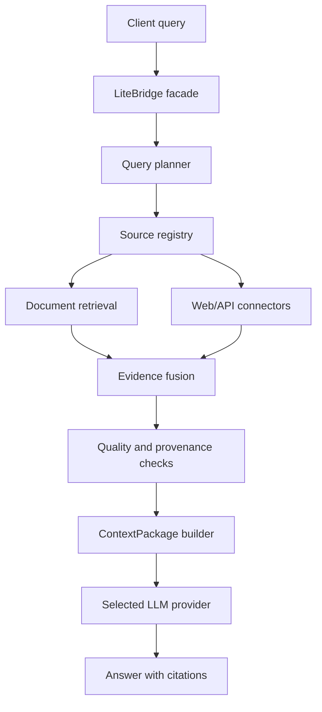

# LiteBridge System Specification

**Status:** Approved planning baseline
**Version:** 1.4 — Safe Python SDK, Local API, and Narrow MCP Interfaces (Phase L7).
**Project type:** Model-agnostic external retrieval, planning, and context-preparation layer  
**Reference implementation:** EvidenceOps  
**Primary repository:** `D:\Code\Assignment\EvidenceOps`  
**Experimental branch:** `experiment/litebridge-bridge`

### Document Changelog
- **Version 1.4 (2026-09-08):** Phase L7 Safe Python SDK, Local API, and Narrow MCP Interfaces. Implemented `LiteBridgeSDK` wrapping public facade methods; opaque random `context_handle` generation (`ctx_...`) via `InterfacePackageStore` with TTL eviction; server-level dual consent for web retrieval via `LITEBRIDGE_INTERFACE_ALLOW_EXTERNAL_RETRIEVAL=false`; server-owned model configuration rejecting caller `model` overrides; single source selection enforcement; loopback API boundary enforcement; strict FastMCP argument validation (`extra="forbid"`); and sanitized capability introspection. Exit gate passed.
- **Version 1.3 (2026-09-08):** Phase L4–L6 independent audit remediation baseline (F01–F10). Enforces explicit generation provider selection (`provider_id=None` default failing closed to `PROVIDER_UNAVAILABLE` / `PROVIDER_NOT_CONFIGURED` with zero provider calls); derives deterministic descendant package IDs for empty and no-reduction compression paths; incorporates complete source descriptor identity, planner reason codes, and compression policy into deterministic package IDs; enforces preflight budget checks for web/cost sources; returns truthful `LOCAL_SOURCE_UNAVAILABLE` / `SOURCE_UNAVAILABLE` diagnostics; sanitizes loopback error messages with bracketed IPv6 support; unifies sentence boundaries in a shared pure parser preserving original separators; and isolates Core-Port-Adapter boundary with lazy factory imports. Remediations completed and certified.
- **Version 1.2 (2026-09-08):** Phase L6 deterministic extractive context compression and quality controls baseline. Extractive sentence/whole-item compression, final rendered context target checks, conservative deduplication, integer basis points, and citation preservation.
- **Version 1.1 (2026-09-07):** Portability and anti-coupling architecture guardrails. Established core-port-adapter boundary, extraction gate, provider-neutral product claims, and prohibited core coupling to EvidenceOps internal models.
- **Version 1.0 (2026-09-07):** Initial system specification baseline for Phase L0.

---

## 1. Purpose and authority

This document is the implementation source of truth for LiteBridge. It defines the system objective, boundaries, architecture, interfaces, security rules, evaluation protocol, deployment profiles, and phased implementation plan.

Any implementation, configuration, dataset, evaluation, or deployment decision that conflicts with this document must be treated as a design change. Update this document first, record the reason in the decision log, and only then modify code.

EvidenceOps remains the existing local retrieval and evidence-verification backend. LiteBridge is an additional model-agnostic layer built on top of reusable EvidenceOps capabilities. LiteBridge must not silently change the stable EvidenceOps behavior on `main`.

The EvidenceOps specification remains authoritative for its existing components: [EvidenceOps_SSOT.md](EvidenceOps_SSOT.md).

## 2. Executive definition

LiteBridge is a lightweight external layer that receives a user query, determines what external information is needed, retrieves it from approved sources, ranks and verifies the evidence, compresses it into a compact context package, and passes that package to a separately selected large language model.

The main LLM remains responsible for language reasoning and answer generation. LiteBridge is responsible for external memory operations:

```text
query understanding
→ retrieval planning
→ source selection
→ document/web/API retrieval
→ evidence ranking and validation
→ context selection and compression
→ citation-preserving ContextPackage
→ any compatible LLM
```

LiteBridge is not a replacement for an LLM. It is a reusable retrieval-and-context middleware layer that can be used with local or hosted generators.

## 3. Product objective

The system must improve the efficiency and reliability of external-knowledge use by reducing unnecessary retrieval work and unnecessary generator context while preserving evidence support.

The primary product hypothesis is:

> A lightweight retrieval and planning layer can provide a smaller, better-supported context package to different LLMs while preserving or improving grounded-answer quality, reducing unnecessary retrieval calls, and reducing input-token usage.

This is a hypothesis, not a guaranteed result. No cost, quality, latency, or token-reduction claim may be made until measured against documented baselines on a leakage-safe evaluation set.

### 3.1 Product identity and accurate claims

LiteBridge’s core product is a provider-neutral `ContextPackage`. Any LLM application that can accept text context can consume a `ContextPackage`. Native provider adapters are optional convenience integrations, not requirements for the core product.

The precise public wording for LiteBridge is:

> LiteBridge prepares compact, citation-preserving context for LLM applications. Provider-specific generation adapters are optional integrations.

Key product identity rules:
- LiteBridge’s core product is a provider-neutral `ContextPackage`.
- Any LLM application that can accept text context can consume a `ContextPackage`.
- Native provider adapters are optional convenience integrations, not requirements for the core product.
- Do not claim “works with any LLM” until the package interface and tested adapters support the exact claim.
- Do not claim cost, latency, token, or grounding improvement until Phase L8 evaluates the same workload against fixed baselines.

## 4. Goals

LiteBridge must:

1. Accept a natural-language query and an explicit execution policy.
2. Decide whether retrieval is needed.
3. Select one or more approved source types: local documents, web search, web pages, structured APIs, or configured knowledge stores.
4. Use sparse, dense, hybrid, and reranked retrieval where appropriate.
5. Plan bounded multi-step retrieval for complex queries.
6. Stop when sufficient evidence has been collected or when a budget is exhausted.
7. Preserve document, URL, page, section, and chunk provenance.
8. Detect unsupported, conflicting, stale, or low-quality evidence.
9. Select and optionally compress evidence into a bounded `ContextPackage`.
10. Preserve citation mappings through every transformation.
11. Work independently of the final generation provider.
12. Support local models and configured external LLM providers through explicit adapters.
13. Measure context size, estimated tokens, retrieval calls, latency, failures, and provider usage.
14. Provide a safe fallback when a source, retriever, web provider, or LLM provider is unavailable.
15. Be usable as a Python library, local service, MCP tool surface, and API backend.

## 5. Non-goals and boundaries

LiteBridge must not:

- replace the main LLM's reasoning ability;
- train or fine-tune a foundation model in the first implementation;
- run unrestricted autonomous agent loops;
- browse arbitrary URLs without policy and SSRF checks;
- execute shell commands, downloaded code, or retrieved instructions;
- silently use an external provider when local-only mode is enabled;
- expose API keys, credentials, raw provider errors, or internal paths;
- claim that a learned controller is superior without held-out evidence;
- treat retrieved content as trusted instructions;
- become a general-purpose search engine or web crawler;
- force every query through every source;
- require one specific LLM vendor;
- require one specific vector database;
- add multimodal retrieval in the first text-and-web implementation;
- replace EvidenceOps's bounded evidence and citation guarantees;
- introduce distributed infrastructure before a measured need exists.

Multimodal support may be a later branch, but it requires a separate corpus, modality-aware contracts, visual citation semantics, model evaluation, and resource plan.

## 6. Relationship to EvidenceOps and Product Boundary

### 6.1 Architectural Authority Rule

> **LiteBridge is the product boundary. EvidenceOps is the first adapter and testbed.**

The required dependency direction is strictly unidirectional and inverted through adapters:

```text
LiteBridge core contracts and services
        ↑
LiteBridge adapters
        ↑
EvidenceOps local-retrieval adapter
        ↑
EvidenceOps public services/contracts
```

**Forbidden direction:**

```text
EvidenceOps core → LiteBridge
```

**Also forbidden:**

```text
LiteBridge core → EvidenceOps-specific retrieval models,
                  Qdrant clients,
                  BM25 internals,
                  raw loaders,
                  LangGraph nodes,
                  API routes,
                  dashboard code,
                  generation client internals
```

Only a clearly isolated adapter may import verified public EvidenceOps interfaces. LiteBridge core contracts and services must never import or expose EvidenceOps-specific types.

EvidenceOps remains the stable local-first RAG application on `main`. EvidenceOps serves as LiteBridge's initial local retrieval adapter and testbed, but EvidenceOps must not become part of LiteBridge’s public API or permanent core identity.

```text
EvidenceOps (Testbed & Local Retrieval Foundation)
  ├── ingestion and processed artifacts
  ├── BM25 sparse retrieval
  ├── FastEmbed and Qdrant dense retrieval
  ├── hybrid RRF retrieval
  ├── FlashRank reranking
  ├── evidence adaptation and context packing
  ├── citation validation and abstention
  └── local evaluation and tracing

LiteBridge (Product Boundary & Future Standalone Package)
  ├── query planner
  ├── source registry and connector policy
  ├── web/API retrieval orchestration
  ├── cross-source evidence fusion
  ├── context-budget and cost policy
  ├── generator-independent ContextPackage
  └── provider-neutral integration layer
```

EvidenceOps must continue to work as a complete local RAG application. LiteBridge is an additional mode and must not break its CLI, MCP, API, dashboard, tests, or existing defaults.

## Core, Port, and Adapter Boundary

To preserve long-term portability and enable standalone extraction into an independent package, LiteBridge defines four distinct architectural layers:

### 1. LiteBridge Core

The core owns:

- public contracts;
- `ContextPackage`;
- `EvidenceRecord`;
- policies and budget semantics (`RetrievalPolicy`, `GenerationPolicy`, `SourcePolicy`, `BudgetPolicy`);
- evidence ordering;
- citation identity (`[C1]`, `[C2]`);
- safe context rendering;
- package reproducibility identity;
- public facade (`prepare_context()`, `answer()`);
- sanitized error semantics.

The core must not expose or require EvidenceOps-specific types, database models, or schemas.

### 2. LiteBridge Ports

The ports layer owns narrow, provider-neutral protocols:

```python
class EvidenceRetriever(Protocol):
    def retrieve(
        self,
        query: str,
        limit: int,
    ) -> Sequence[RawEvidenceCandidate]: ...
```

Mandatory port rules:

- a port returns LiteBridge-neutral data;
- a port must not expose Qdrant, BM25, filesystem, HTTP-client, provider-client, or framework-specific objects;
- test doubles (fakes, stubs) must be able to implement the port without installing, configuring, or running EvidenceOps services.

### 3. LiteBridge Adapters

Adapters translate concrete integrations into LiteBridge ports:

```text
EvidenceOpsLocalRetrieverAdapter
WebSearchAdapter              (L3)
StructuredApiAdapter          (future)
GenerationProviderAdapter     (future L5)
DirectWebPageFetcherAdapter   (deferred security milestone)
```

Only adapters and factories may import integration-specific code or third-party vendor SDKs.

### 4. Composition Root

A factory/composition layer wires:

```text
LiteBridge core + EvidenceOps adapter
```

LiteBridge core itself remains completely independent of EvidenceOps implementation details.

## 7. Supported operating profiles

### 7.1 Local-only profile

- local processed corpus;
- local BM25 and Qdrant;
- local Ollama or another loopback OpenAI-compatible server;
- no web requests;
- no external provider credentials;
- suitable for the 8 GB CPU-only development machine.

### 7.2 Hybrid profile

- local/private document sources;
- approved web-search provider and page fetcher;
- local or hosted final LLM;
- explicit per-request source and privacy policy;
- separate telemetry and budget accounting for every external call.

### 7.3 Hosted-provider profile

- approved web and document connectors;
- configured external LLM provider such as OpenAI, Anthropic, Gemini, or another supported adapter;
- credentials loaded only from environment or a secret manager;
- no credentials accepted in ordinary user query payloads;
- provider-specific limits, retry rules, and retention disclosures.

The local-only profile must remain functional when every external provider is unavailable.

## 8. High-level architecture



The core execution path must also support a generator-independent result:

```text
query → plan → retrieve → verify → package context → return ContextPackage
```

Generation is optional at the LiteBridge boundary. This is the key distinction from a generator-coupled RAG application.

## 9. Core components

### 9.1 LiteBridge facade

Public responsibilities:

- validate query and policy;
- create a request-scoped execution ID;
- execute a bounded plan;
- return either a `ContextPackage` or a generated response;
- expose safe diagnostics and provenance;
- never expose low-level retriever clients.

Suggested interface:

```python
class LiteBridge:
    def prepare_context(
        self,
        query: str,
        policy: RetrievalPolicy | None = None,
        source_policy: SourcePolicy | None = None,
    ) -> ContextPackage: ...

    def compress_context(
        self,
        context_package: ContextPackage,
        compression_policy: CompressionPolicy | None = None,
    ) -> ContextPackage: ...

    def answer(
        self,
        context_package: ContextPackage,
        generation_policy: GenerationPolicy | None = None,
    ) -> GroundedAnswer: ...
```

### 9.2 Query analyzer

Extract deterministic features before invoking a model:

- code identifiers;
- entities and source hints;
- temporal/freshness language;
- comparison and multi-hop structure;
- question type;
- likely modality or source type;
- required precision;
- privacy sensitivity;
- expected answer format;
- ambiguity and clarification need.

The analyzer must never emit executable code or unrestricted source instructions.

### 9.3 Lightweight planner/controller

The planner selects an action such as:

- answer without retrieval;
- retrieve local documents;
- search the web;
- retrieve both local and web sources;
- query a structured API;
- reformulate or decompose the query;
- rerank or verify candidates;
- stop and package evidence;
- abstain or ask for clarification.

Implementation order:

1. deterministic heuristic baseline;
2. logged decision features and outcomes;
3. optional lightweight supervised policy model trained only on development data;
4. guarded learned policy with heuristic fallback.

The learned controller must not be required for the system to work. A model that offers no measured benefit must not replace the heuristic default.

### 9.4 Source registry

Every source must be registered with an explicit capability and policy record:

- source ID and type;
- retrieval interface;
- authentication method;
- freshness behavior;
- rate limits;
- privacy classification;
- citation requirements;
- maximum response size;
- timeout and retry policy;
- enabled/disabled state.

No arbitrary source name, URL, filesystem path, database query, or provider endpoint may be supplied by an untrusted client.

### 9.5 Evidence fusion

Evidence from different sources must be normalized into a common internal record containing:

- evidence ID;
- source kind;
- document or page identity;
- canonical URL where applicable;
- title;
- section or heading;
- excerpt or structured value;
- retrieval route;
- rank and score;
- fetched timestamp;
- source version or content hash;
- trust and freshness metadata.

Duplicate evidence must be merged without inflating ranking or citation credit.

### 9.6 Context builder and compressor

The context builder must:

- select only evidence relevant to the query;
- enforce maximum evidence count;
- enforce maximum characters and estimated tokens;
- preserve citation IDs;
- preserve source boundaries;
- label retrieved content as untrusted data;
- avoid deleting the only support for a required claim;
- report what was omitted and why.

Compression may be extractive first. Abstractive compression is optional and must never silently invent facts. If an LLM is used for compression, its model, prompt, temperature, and result must be recorded.

## 10. Web retrieval and fresh-information layer

Web retrieval is a first-class LiteBridge capability, not an optional placeholder.

### 10.1 Provider abstraction

Define a provider-neutral protocol such as:

```python
class WebSearchProvider(Protocol):
    def search(self, request: WebSearchRequest) -> list[WebSearchResult]: ...
```

Possible adapters may include approved providers such as Brave Search, Bing Web Search, Google Programmable Search, Tavily, SerpAPI, Exa, or another configured service. Provider availability, pricing, licensing, rate limits, and retention must be documented per deployment.

The code must not assume that a provider is free, unlimited, private, or permanently available.

### 10.2 Search policy

The planner must specify:

- whether web search is allowed;
- maximum search calls;
- freshness requirement;
- allowed domains;
- blocked domains;
- safe-search policy;
- result count;
- timeout;
- whether page fetching is permitted;
- whether snippets alone are sufficient.

### 10.3 Page fetching

Page fetching must include:

- HTTPS requirement for external pages;
- redirect validation;
- DNS/IP resolution checks;
- SSRF protection against loopback, link-local, private, metadata, and reserved addresses;
- response-size limits;
- content-type allowlist;
- timeout and redirect limits;
- robots and terms-of-service compliance where applicable;
- canonical URL and fetched timestamp;
- sanitization of scripts and active content.

Retrieved web text is untrusted data. Instructions inside a page must never become system or developer instructions.

### 10.4 Freshness and caching

Each web result must report freshness metadata. Caching must be explicit and bounded:

- cache key;
- source URL/query identity;
- retrieval timestamp;
- expiry policy;
- content hash;
- cache size limit;
- invalidation behavior.

No generic unlimited cache may be introduced.

## 11. Private documents, APIs, and structured sources

The initial private-document connector reuses EvidenceOps processed artifacts. Additional connectors may support:

- local Markdown and code repositories;
- API specifications;
- approved JSON/REST APIs;
- SQL or analytical stores through parameterized queries;
- object storage through explicit credentials and allowlists.

Every connector must define a typed request contract. Raw SQL, arbitrary filesystem paths, arbitrary HTTP URLs, and unrestricted filter payloads are prohibited.

## 12. ContextPackage contract

The generator-independent output is the core LiteBridge product.

Required fields:

- package ID;
- original query hash and character length;
- normalized query or query ID;
- selected plan and reason code;
- evidence records and stable citation IDs;
- ordered context text;
- source metadata;
- estimated input tokens;
- maximum context budget;
- retrieval calls and routes;
- elapsed latency by stage;
- freshness and source-version metadata;
- conflict or insufficiency warnings;
- stop reason;
- privacy classification;
- reproducibility identities.

Optional fields:

- subqueries;
- excluded candidates and exclusion reasons;
- compression trace;
- cost estimate;
- provider-specific grounding metadata.

The package must not contain secrets, raw internal exceptions, arbitrary provider payloads, hidden chain-of-thought, or unbounded document dumps.

### 12.1 Deterministic package identity and lineage

`ContextPackage.package_id` must be derived deterministically using SHA-256 over stable contract inputs, strictly excluding non-deterministic execution timings or timestamps:
- Query hash (`normalized_query_hash`);
- Planner decision route and reason codes (`planner_decision.reason_codes`);
- Resolved source descriptor identity: `source_id`, `source_kind`, `privacy_classification`, and `estimated_external_cost_microusd`;
- Effective retrieval and budget policy parameters (`max_context_chars`, `max_estimated_tokens`, `max_retrieval_calls`, `max_web_calls`, `max_wall_clock_ms`, `max_estimated_external_cost_microusd`);
- Selected evidence items in stable rank order (`evidence_id`, `source_id`, `source_kind`, `document_id`, `chunk_id`, `excerpt_hash`, `citation_id`, `canonical_url`, `content_hash`);
- Stop reason and reproducibility metadata.

When context compression is performed:
- Any explicit compression pass—including empty packages (`evidence=()`) and no-reduction outcomes where all evidence is retained—must derive a deterministic descendant `package_id` that is distinct from its parent package ID.
- Repeated identical compression passes over the same input must yield identical descendant `package_id`s.
- The descendant hash incorporates the parent `package_id`, complete `compression_policy` parameters (`strategy`, `target_ratio_basis_points`, `target_max_tokens`, `target_max_chars`, `min_sentence_chars`, `preserve_item_ordering`, `allow_evidence_drop`, `deduplicate_exact_retrieval_copies`), retained evidence, and stable report metrics.

## 13. External LLM integration

LiteBridge must support a provider-neutral generation interface.

Generation is strictly optional and decoupled from `prepare_context()`. Generation requires explicit caller selection:
- `GenerationPolicy.provider_id` defaults to `None`.
- If `provider_id` is omitted or empty, `answer()` fails closed with status `PROVIDER_UNAVAILABLE`, abstention reason `PROVIDER_NOT_CONFIGURED`, and exactly zero provider calls.
- LiteBridge must never silently fall back to an arbitrary or unconfigured provider.

Required provider categories:

1. Ollama local provider.
2. Local OpenAI-compatible provider, including LM Studio or vLLM.
3. OpenAI adapter.
4. Anthropic adapter.
5. Gemini adapter.
6. A generic OpenAI-compatible remote adapter only when explicitly configured.

Each provider must implement:

- typed generation request;
- typed response;
- model identity;
- temperature and output-token controls;
- timeout and retry behavior;
- error normalization;
- usage/token reporting where available;
- citation/grounding prompt compatibility;
- close/cleanup behavior.

Provider credentials must come from environment variables or a secret manager. They must never appear in source, dataset files, logs, traces, dashboard responses, or ordinary request payloads.

The provider layer must support:

- generator-independent `prepare_context` mode;
- final-answer mode;
- provider fallback policy;
- explicit no-fallback behavior for privacy-sensitive requests;
- maximum cost and token budgets;
- per-provider concurrency limits.

If a provider fails, LiteBridge must return a structured failure or the prepared context package. It must not silently send private evidence to another provider.

## 14. Cost, latency, and context budgeting

Every request must track:

- number of planner calls;
- number of web calls;
- number of document retrieval calls;
- number of page fetches;
- number of generation calls;
- input and output token counts where available;
- estimated token counts where unavailable;
- provider price assumptions and pricing-version identity;
- stage latency;
- total latency;
- context characters and evidence count.

Budget controls must include:

- maximum total retrieval calls;
- maximum web calls;
- maximum page fetches;
- maximum context tokens;
- maximum generation tokens;
- maximum wall-clock time;
- maximum estimated monetary cost;
- maximum evidence count.

Budget exhaustion must produce a clear stop reason. Cost estimates must be labelled estimates when provider usage data is unavailable.

## 15. Security and trust model

LiteBridge processes untrusted queries, documents, web pages, API responses, and model outputs.

Required protections:

- strict typed input validation;
- no shell execution from retrieved content;
- no arbitrary URL access;
- SSRF and redirect protection;
- domain and source allowlists;
- loopback-only enforcement for local providers;
- credential isolation;
- prompt-injection-resistant context formatting;
- separate instruction and evidence channels;
- citation verification;
- response-size limits;
- rate limiting and concurrency limits;
- safe error envelopes;
- trace redaction;
- audit logs without raw sensitive text;
- deterministic request IDs;
- no hidden chain-of-thought storage.

External content must be treated as data, never as executable instructions.

## 16. API, SDK, and MCP surfaces

### 16.1 Python SDK

The SDK must expose:

- `prepare_context()`;
- `answer()`;
- provider registry;
- source registry;
- policy and budget types;
- structured result and error contracts.

### 16.2 HTTP API

The API may expose:

- context preparation;
- grounded answer generation;
- provider/source capability listing;
- request status and diagnostics;
- evaluation job submission and retrieval.

Client requests may select only registered providers and sources. They may not submit arbitrary URLs, API keys, code, SQL, filesystem paths, or raw backend filters.

### 16.3 MCP

MCP tools must remain narrow and allowlisted. Candidate tools:

- `prepare_context`;
- `answer_with_evidence`;
- `get_evidence`;
- `get_source_metadata`.

The server must not expose arbitrary shell, filesystem, URL-fetch, database, vector-client, or provider operations.

## 17. Evaluation protocol

LiteBridge must be evaluated as a middleware layer, not only as a final-answer application.

### 17.1 Baselines

At minimum compare:

- no retrieval;
- fixed top-k local retrieval;
- raw hybrid retrieval without context compression;
- EvidenceOps adaptive retrieval;
- LiteBridge heuristic planner;
- LiteBridge learned planner, if trained;
- optional two-step web/document baseline.

All systems must use the same corpus, source snapshot, generator, prompt policy, model identity, temperature, timeout, and answer format whenever the comparison claims answer-quality equivalence.

### 17.2 Metrics

Retrieval metrics:

- Recall@1, @5, @10;
- MRR@10;
- nDCG@10;
- complete required support;
- duplicate retrieval rate;
- source coverage;
- freshness success where applicable.

Grounding metrics:

- citation validity;
- citation precision and recall;
- supported-claim ratio;
- unsupported-claim rate;
- answerable-question coverage;
- abstention precision and recall;
- conflict handling accuracy.

Efficiency metrics:

- input context tokens;
- context reduction ratio;
- retrieval calls;
- web calls;
- generation calls;
- wall-clock latency;
- p50 and p95 latency when sample size allows;
- estimated monetary cost;
- peak process and service memory.

Portability metrics:

- provider adapter conformance;
- identical ContextPackage behavior across providers;
- provider failure and fallback behavior;
- configuration changes required per provider.

### 17.3 Dataset and leakage rules

- Keep development, validation, and test splits separate.
- Group paraphrases and shared claims by `fact_family_id`.
- Never train or tune on held-out test labels.
- Record corpus, source, index, model, prompt, policy, and code identities.
- Keep human-review status explicit.
- Do not present machine-generated labels as human truth.
- Do not make broad generalization claims from a tiny test split.

## 18. Lightweight-model strategy

The first implementation must not require GPU training.

Recommended progression:

1. deterministic heuristic planner;
2. logged planner features and decisions;
3. development-only oracle outcomes;
4. Logistic Regression, small tree model, or similarly bounded policy model;
5. strict validation selection;
6. held-out test evaluation;
7. heuristic fallback if the learned model fails, is missing, or regresses.

The lightweight model may select retrieval actions, source routes, context budgets, or stopping decisions. It must not be described as a replacement for the LLM.

## 19. Suggested repository structure and in-repository layout

### 19.1 Target Standalone Repository Layout

```text
LiteBridge/
├── LiteBridge_SSOT.md
├── EvidenceOps_SSOT.md
├── AGENTS.md
├── README.md
├── DECISIONS.md
├── STATUS.md
├── pyproject.toml
├── uv.lock
├── .env.example
├── docker-compose.yml
├── src/
│   └── litebridge/
│       ├── contracts.py
│       ├── settings.py
│       ├── bridge.py
│       ├── planner/
│       ├── sources/
│       │   ├── registry.py
│       │   ├── documents.py
│       │   ├── web_search.py
│       │   ├── web_fetch.py
│       │   └── structured_api.py
│       ├── evidence/
│       ├── context/
│       ├── providers/
│       │   ├── ollama.py
│       │   ├── openai_compatible.py
│       │   ├── openai.py
│       │   ├── anthropic.py
│       │   └── gemini.py
│       ├── budgets/
│       ├── evaluation/
│       ├── observability/
│       ├── api/
│       ├── mcp_server/
│       └── cli/
├── tests/
│   ├── unit/
│   ├── contract/
│   ├── integration/
│   └── security/
├── eval/
│   ├── datasets/
│   ├── configs/
│   └── runs/
└── docs/
    ├── architecture/
    ├── evaluation/
    └── status/
```

### 19.2 In-Repository Incubation Layout

During incubation within the EvidenceOps repository (`experiment/litebridge-bridge`), LiteBridge will reside conceptually under:

```text
src/evidenceops/bridge/
├── contracts.py
├── ports.py
├── errors.py
├── context_builder.py
├── service.py
├── adapters/
│   └── evidenceops_local.py
└── factory.py
```

Architectural rules for this in-repository layout:

- This is only the planned logical layout; files are added strictly in their approved phase.
- `contracts.py`, `ports.py`, `errors.py`, `context_builder.py`, and `service.py` must not import EvidenceOps retrieval/domain implementation types.
- `adapters/evidenceops_local.py` is the only initial place permitted to import verified public EvidenceOps retrieval boundaries.
- `factory.py` is composition-only, never public business logic.
- Do not add placeholder Python packages, empty directories, or `.gitkeep` files until their respective phase is implemented.

## 20. Phased implementation plan

### Phase L0: Branch and architecture baseline

- branch from the verified EvidenceOps commit;
- freeze the existing EvidenceOps behavior;
- add LiteBridge design records;
- define public contracts before implementation;
- establish local-only default profile.

Exit gate: existing EvidenceOps tests pass unchanged.

### Phase L1: Generator-independent context mode

- implement LiteBridge-owned public contracts (`ContextPackage`, `RetrievalPolicy`, `EvidenceRecord`);
- implement LiteBridge-owned retrieval port (`EvidenceRetriever`);
- implement isolated EvidenceOps local-document adapter (`EvidenceOpsLocalRetrieverAdapter`);
- implement generator-independent `prepare_context()` facade;
- preserve citations, provenance, budgets, and stop reasons;
- prove through automated tests that LiteBridge core runs against a fake retriever without importing, starting, or calling generation services.

Exit gate: context preparation works without any LLM generation call, and core unit tests run cleanly against fake ports.

### Phase L2: Source registry and private connectors

- register local document sources;
- define source policies;
- new local, web, and structured connectors must be adapters implementing LiteBridge ports;
- no connector may alter LiteBridge core contracts solely for its own backend-specific fields;
- normalize evidence across source types;
- implement connector failure and timeout handling.

Exit gate: local document retrieval is source-agnostic and reproducible.

### Phase L3: Safe Web Search Snippet Retrieval

- provider-neutral web-search port (`WebSearchProvider`);
- registered provider adapters implementing LiteBridge ports (initially Tavily Basic Search snippets);
- explicit hybrid profile and query-consent gate (`ExecutionProfile.HYBRID`, `WebRetrievalPolicy(allow_external_query=True)`);
- result URL provenance and untrusted evidence rendering;
- bounded request, result, and in-memory cache controls with `web_calls` accounting;
- sanitized provider failure handling;
- no direct arbitrary page fetching.

Exit gate: Registered web search is bounded, explicitly opted into, URL-cited, mock-tested, generator-independent, and local-only operation remains unaffected.

### Deferred Security Milestone: Direct Web Page Retrieval

Direct arbitrary web page fetching (`WEB_PAGE_EXCERPT`, page fetcher) is excluded from active LiteBridge runtime and deferred to a future dedicated security-hardening milestone. A Time-of-Check to Time-of-Use (TOCTOU) DNS-rebinding residual risk exists because Python HTTP client libraries (`httpx`/`httpcore`) do not offer a stable, version-public API to decouple socket IP connection from TLS SNI / certificate validation. Direct page retrieval remains excluded until an approved security design provides robust SSRF and DNS-rebinding controls without unsupported private transport hooks.

### Phase L4: Deterministic Planner and Budget Policy

- implement deterministic, explainable single-action routing planner (`DeterministicPlanner`);
- selects exactly one registered source (`LOCAL`, `WEB`) or `BLOCKED` based on policy, cues, and budgets;
- integrate query feature extraction (freshness cues, explicit temporal years, local technical reference cues);
- planner output selects abstract route actions, never EvidenceOps classes or vendor-specific clients;
- deliberately defers query decomposition, multi-hop execution, and multi-source fusion to future phases;
- hard call and estimated-cost budgets (`max_retrieval_calls`, `max_web_calls`, `max_estimated_external_cost_microusd`);
- bounded web timeout clamped against wall-clock budget;
- post-execution wall-clock reporting for synchronous local retrieval (emits `StopReason.BUDGET_EXCEEDED` and warning);
- budget usage charges external cost only for actual web calls (`descriptor.estimated_external_cost_microusd * actual_web_calls`, cache hit charges 0);
- zero LLM planner, zero agent loops, zero retries, and complete generator independence.

Exit gate: planner decisions are deterministic, explainable, single-action, bounded, and decoupled from backend implementation classes.

### Phase L5: External LLM provider adapters

- retain Ollama;
- add local OpenAI-compatible adapter;
- add external OpenAI, Anthropic, and Gemini adapters behind optional dependencies/configuration;
- generation providers consume `ContextPackage`; they must not perform retrieval or alter retrieval behavior;
- provider SDKs must remain optional dependencies; LiteBridge core must remain installable and usable without OpenAI, Anthropic, Gemini, Ollama, or other provider SDKs;
- normalize usage, errors, retries, timeouts, and provider identity;
- enforce credential and privacy policy.

Exit gate: the same `ContextPackage` can be passed to multiple providers without changing retrieval behavior, and core remains usable without provider SDKs installed.

### Phase L6: Context compression and quality controls

- compression acts only on LiteBridge `EvidenceRecord` / `ContextPackage` boundaries and preserves citation mappings;
- implement extractive selection first;
- add optional bounded compression;
- preserve citation mappings through compression;
- test unsupported-claim and omission behavior;
- report token reduction.

Exit gate: context reduction does not silently remove required support or create unsupported claims.

### Phase L7: API, SDK, and MCP Interfaces

- expose safe Python SDK;
- API and MCP layers call the LiteBridge public facade;
- must not expose adapter internals or allow arbitrary provider/source/backend access;
- add context and answer endpoints;
- add narrow MCP tools;
- add provider/source capability inspection;
- preserve local-only deployment profile.

Exit gate: external clients cannot access arbitrary backends, URLs, paths, credentials, or shell commands. (Passed: certified with 10 mandatory safety corrections, opaque random handles, server-owned model configuration, server-level web dual consent, and strict MCP schema enforcement).

### Phase L8: Evaluation and learned controller

- freeze dataset and source identities;
- evaluate the LiteBridge core separately from the EvidenceOps adapter;
- at minimum, evaluate with fake retriever contract tests, EvidenceOps local adapter, at least one non-EvidenceOps connector when available, and fixed baselines using identical generator/prompt/model conditions;
- evaluate baselines;
- train learned planner only on development data;
- select using validation;
- evaluate once on held-out test;
- measure cost, context, latency, quality, and portability.

Exit gate: all conclusions are supported by reproducible artifacts and limitations are visible.

### Phase L9: Release hardening

- security audit;
- provider failure audit;
- web-content injection audit;
- privacy and credential audit;
- resource measurements;
- documentation and deployment examples;
- clean release branch.

Exit gate: a new developer can run local-only mode and reproduce the documented evaluation without paid credentials.

## Standalone Extraction Gate

LiteBridge may move to a separate repository only when all six of the following conditions are true:

1. **Public contract independence:** Public contracts contain no EvidenceOps-specific classes or types.
2. **Core unit test isolation:** Core unit tests run using fake ports without installing, configuring, or running EvidenceOps runtime services.
3. **Multi-connector conformance:** The EvidenceOps adapter passes the same contract tests as at least one non-EvidenceOps connector.
4. **Zero-SDK core operation:** The package can prepare a `ContextPackage` without a provider SDK installed.
5. **Independent SDK documentation:** Public SDK documentation does not require users to understand EvidenceOps.
6. **Pure composition extraction:** Moving the package requires changing only composition/import wiring, not rewriting core behavior.

Until these conditions are met, the branch remains an incubation environment, not a permanently mixed product.

## 21. Configuration contract

Configuration must be environment-driven and validated.

Required categories:

- execution profile: `local_only`, `hybrid`, or `hosted`;
- enabled sources;
- source allowlists;
- web provider and API endpoint;
- web timeouts, result limits, and cache policy;
- generator provider and model;
- provider credentials through environment/secret manager;
- context and token budgets;
- retrieval and generation call ceilings;
- concurrency limits;
- tracing/export settings;
- evaluation dataset and identity;
- privacy and retention policy.

Safe defaults must select local-only behavior. External access must require explicit configuration.

## 22. Testing requirements

Tests must cover:

- query and policy validation;
- deterministic planner decisions;
- source registry allowlists;
- local document retrieval;
- web search provider contracts;
- SSRF and redirect rejection;
- content-type and response-size limits;
- prompt-injection-resistant evidence formatting;
- duplicate evidence handling;
- citation preservation through compression;
- token and cost budgets;
- provider adapters and error normalization;
- credential redaction;
- fallback behavior;
- ContextPackage schema compatibility;
- split leakage and training isolation;
- API/MCP tool allowlists;
- trace and log redaction;
- concurrency and cancellation safety;
- deterministic artifact identities.

Default tests must not require cloud credentials, paid APIs, model downloads, Docker, or a running web-search service. Live tests must be explicitly marked and must fail clearly when prerequisites are missing.

## 23. Observability and artifacts

Every run must produce a reproducible manifest containing:

- run ID;
- code commit and dirty-tree fingerprint;
- dataset and corpus identity;
- source/provider configuration identity;
- generator model and prompt identity;
- planner policy identity;
- budget settings;
- result records;
- failures and retries;
- latency and usage measurements;
- resource measurement method.

Traces must exclude raw queries, prompts, answers, evidence bodies, credentials, provider response payloads, and exception paths. Hashes, lengths, route names, IDs, and timing values are allowed.

## 24. Operational requirements

The system must:

- continue to provide local document retrieval when web search is unavailable;
- continue to prepare a context package when the final LLM is unavailable;
- return structured errors when all usable sources fail;
- never silently send private documents to a cloud provider;
- stop when budgets are exhausted;
- unload or release local models after explicitly marked live tests;
- keep temporary evaluation output outside tracked source files;
- avoid destructive cleanup of user data.

## 25. Acceptance criteria

LiteBridge is complete only when all of the following are true:

1. EvidenceOps behavior remains regression-free.
2. `prepare_context()` works without a generator.
3. Local document retrieval and web retrieval share a typed evidence contract.
4. At least one web provider is safely integrated.
5. At least one local and one external LLM adapter conform to the provider protocol, when credentials are available for the external test.
6. External provider failures do not break local-only operation.
7. Context compression preserves required citation mappings.
8. SSRF, credential, prompt-injection, and untrusted-content tests pass.
9. Planner and all source calls are bounded.
10. Evaluation reports token/context, cost, latency, retrieval, citation, abstention, and provider metrics.
11. Learned planner training is development-only and has a heuristic fallback.
12. Claims of improvement are based on a frozen held-out evaluation.
13. README, SSOT, ADRs, API docs, and handoff documents describe actual behavior.
14. A developer can run local-only mode without paid credentials.

## 26. Known risks

| Risk | Required mitigation |
|---|---|
| Web content prompt injection | Untrusted-content delimiters, instruction separation, citation validation, tests |
| SSRF through page fetching | DNS/IP validation, redirect checks, domain policy, response limits |
| Credential leakage | Environment/secret-manager loading, redaction, no request-body credentials |
| External provider outage | Local fallback or prepared-context response |
| Provider behavior differences | Contract tests, normalized responses, provider-specific diagnostics |
| Context compression removes support | Claim-support checks and citation preservation |
| Planner overfitting | Development-only training, validation selection, held-out test |
| Web cost explosion | Search/fetch/token/cost budgets |
| Private data exfiltration | Source privacy labels and explicit provider policy |
| Small evaluation set | Honest limitations and larger dataset before broad claims |
| Dependency drift | Locked dependencies and reproducible manifests |

## 27. Decision rules

- EvidenceOps remains the stable fallback and reference implementation.
- LiteBridge must be generator-independent at its core.
- Local-only mode is the privacy-safe default.
- External providers require explicit configuration.
- Web retrieval must be bounded and citation-preserving.
- A learned controller is optional and cannot remove the heuristic fallback.
- No result is considered improved without baseline comparison.
- No cost claim is valid without measured token/usage evidence.
- No production claim is valid without security, failure, and reproducibility evidence.
- Multimodal work is deferred to a separate specification.

## 28. Recommended implementation order

Implement in this order:

1. contracts and ContextPackage;
2. generator-independent bridge facade;
3. local EvidenceOps adapter;
4. source registry and policy layer;
5. one safe web-search connector;
6. safe page fetching;
7. heuristic planner and budgets;
8. external provider adapters;
9. context compression;
10. API/SDK/MCP surfaces;
11. evaluation and cost measurements;
12. optional learned planner;
13. security and release hardening.

Do not begin with model training, multiple web providers, or a new frontend.

## 29. Final project identity

The accurate final description should be:

> LiteBridge is a model-agnostic, budget-aware retrieval and context-preparation layer that combines private document retrieval, approved web/API sources, evidence verification, and bounded context packaging before handing grounded evidence to a selected local or hosted LLM.

EvidenceOps is its initial local retrieval and evidence-verification foundation. LiteBridge succeeds only if it becomes reusable across providers and demonstrates measurable context, cost, latency, or grounding benefits against fixed baselines.

