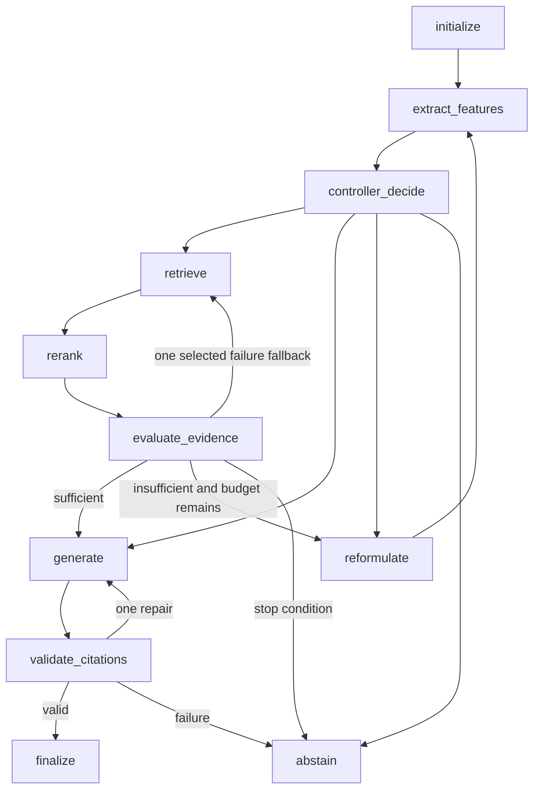

# Phase 3 completion handoff

Completed 2026-09-06; implementation and live verification began 2026-09-05.
This supersedes `phase-3-early-orchestration.md`.

## Verdict and scope

Phase 3 is implemented and verified, including real native Ollama generation,
Qdrant retrieval, FlashRank reranking and a cited retrieval-to-generation answer.
The early eleven-node architecture, domain contracts, deterministic controller,
evidence modules, generator protocol, QueryService and CLI were retained.
No SSOT edits, new paid services, MCP contract changes, retrieval algorithm rewrite,
FastAPI, dashboard, evaluation harness or telemetry were introduced. Nothing was
staged, committed or pushed. Phase 4 has not started.

Phase 1C implementation is complete. Its separate 30-question human judgment gate
remains pending: `docs/superpowers/Retrieval Inspection Review.md` and the Phase 1C/2
handoffs still record pending review, with no recorded acceptance found. Phase 3
smoke results do not replace those judgments or establish retrieval quality gains.

## Retained interfaces and corrected defects

- `EvidenceOpsState` remains the canonical state. A shared decorator validates every
  node input and output through Pydantic, including direct node calls in tests.
- `QueryRequest` retains query, run ID, budget and citation/temperature fields, with
  an optional trace ID. Queries are stripped and bounded to 1,000 characters;
  temperature overrides must be zero. Unknown fields and invalid settings fail.
- `QueryService` explicitly injects project-owned retriever, reranker, controller,
  feature, reformulator and generator protocols. Settings and request preferences
  propagate into state; smaller request/configuration budgets take precedence.
- `QueryResponse` retains answer, evidence, citations, status and counters, adding
  route, trace ID, attempt summaries, generation count, context size, evidence status,
  decision code, conflict witnesses and validation/reranking flags. Metadata is
  allowlisted; prompts, raw graph dictionaries and backend exception strings are absent.
  Evidence text is returned as source evidence, not logged by the application.
- `DocumentationRoute` calls the Phase 2 public `search_results` and
  `get_source_metadata` methods lazily. This fixes reading uninitialized service
  attributes and hydrates authoritative source provenance. Phase 2 MCP schemas remain
  unchanged. Graph nodes do not import BM25, FastEmbed, Qdrant or FlashRank libraries.
- `evidenceops-query` validates overrides before dependency use, injects real reranking,
  emits structured JSON or cited text, and returns nonzero for service failures.
  `--help` neither loads models nor contacts services. Ordinary policy abstentions
  return exit zero with an explicit reason. Only greetings can use
  `--no-require-citations` to skip retrieval.

Confirmed corrections include no-op reranking, unvalidated state dictionaries,
missing request propagation, silently substituted retrieval routes, fabricated latency,
late retrieval guards, missing repeated/unchanged stop conditions, incorrect conflict
threshold, unsafe error strings, factual empty-context generation and generator failures
treated as answers. Additional regression tests cover conflict witnesses discarded by
reranking, spurious conflicts between code examples, metadata leakage, forged direct
completion, and explicit invalid Ollama options being replaced with defaults.

## State and topology

State carries original/current query, features, selected route/action/reason, attempt
history, counters, raw retrieval candidates, reranked evidence, packed context,
sufficiency components, conflict witnesses, generated answer, citation outcome and
terminal reason. Workflow extension fields remain under validated metadata to retain
the existing dictionary transport contract. All score/latency fields reject non-finite
numbers. Completed states require an answer and successful citation validation;
factual completions require known evidence citations. Direct completion additionally
requires the shared greeting policy and disabled citation requirement. Abstentions
require a reason. Terminal states clear their next action and rejected answer/citations.

Initialize sets running status; features/controller choose a route; retrieve measures
the actual search; rerank validates and reorders candidates; evaluate packs and scores
evidence; reformulate makes a bounded distinct refinement; generate builds a grounded
prompt; validation checks packed IDs; finalize and abstain terminate.

Controller priority is budgets and sufficient evidence, conflicts/refinement, then
initial routing. Comparison/multi-hop queries use hybrid before exact identifiers use
sparse; other factual conceptual, ambiguous or temporal queries default to dense unless
another feature takes priority. Greetings use direct mode only with citations disabled.
Stable decision codes include `route_sparse_exact_identifier`,
`route_dense_semantic_query`, `route_hybrid_complex_query`, `route_refined_query`,
`local_failure_fallback`, `direct_answer_non_factual_greeting` and budget/stop codes.
The retained standalone controller can propose an untried independent conflict route;
the compiled workflow uses immediate conflict abstention, as permitted by the SSOT.

Termination follows explicit monotonic counters, not the recursion limit:

| Path | Bound and stop |
|---|---|
| Retrieval | Guard before invocation; actual calls increment once, maximum 3 |
| Missing route | Record failure without incrementing an unexecuted search |
| Backend fallback | At most one configured untried route; its actual call is counted |
| Reformulation | Increment once for successful distinct refinement, maximum 3; reaching the iteration limit stops before another search |
| Repetition | Repeated query/route and unchanged retrieved ID sets stop |
| Generation | Count immediately before each call, maximum 2 total |
| Citation repair | One additional generation, then valid completion or abstention |
| Context | At most 6 chunks and 24,000 formatted characters; smaller settings honored |
| Last-resort guard | Recursion limit 64; mapped to structured `recursion_guard` failure |

Tests exercise all eleven node boundaries, every controller action/conditional route,
topology, all 1..3 budget combinations and structured recursion failure. Manual CLI
cases reached three calls/two reformulations and two generations on separate paths.

## Retrieval and evidence

The selected public route receives at most 20 requested candidates. Failures are
sanitized and recorded with measured elapsed time. The one fallback is explicitly
selected from available untried local routes; there is no in-memory replacement.
Unchanged evidence and duplicate query-route guards prevent useless repeated calls.

Configured reranking invokes the existing Phase 1C Reranker with at most 20 candidates
and requested context limit at most 6. It validates membership, full chunk identity,
uniqueness, cardinality and finite scores. Sorting uses score, original rank, then ID.
Original retrieval method/rank/score and separate rerank score remain available.
Empty candidates do not load the model. Missing/invalid configured reranking abstains;
injected tests without a reranker may use the documented retrieval-rank ordering.

Adaptation deduplicates stable chunk IDs, rejects contradictory duplicate content or
provenance, merges sorted route provenance and component ranks/scores, and does not
mutate retrieval objects. Best-rank route and score remain paired deterministically.
Context sorts deterministically, assigns C1..Cn to selected chunks, escapes untrusted
text/attributes, and counts wrappers and delimiters in the character budget. Whole
chunks that cannot fit are skipped; an oversized first chunk is deterministically
head-truncated with a marker and intact assigned label. Citation metadata is separate.

Sufficiency uses exactly `S = 0.45R + 0.25C + 0.15D + 0.15A`:

- R: mean available rerank scores among the top five, clamped to [0,1]; without
  reranking, reciprocal first retrieval rank, set to zero when lexical coverage is zero.
- C: fraction of non-stopword query tokens covered by packed text, including the
  existing simple plural/substring heuristic; no eligible tokens gives 1.
- D: min(unique documents / 2, 1) for multiple chunks; 0.70 for a single chunk.
- A: 0.50 plus 0.30 for definition syntax and 0.20 for a code block, capped at 1;
  zero when coverage is zero. Empty evidence makes every component zero.

Sufficient means S >= 0.72; low evidence means S < 0.35. All components are tested
and bounded. These are heuristic scores, not probabilities or calibrated confidence.
Generation requires evaluated sufficient evidence and conflict below 0.30.

Conflict detection compares matching normalized prose attributes with matching units,
or direct support/negation claims about matching subjects. It ignores fenced examples
and typed assignments. A detected contradiction scores 0.75; no detection scores zero.
The material threshold is 0.60. All retrieved candidates are checked before reranking;
witness IDs and conflict score persist. Material conflicts immediately abstain so the
generator cannot silently choose a claim. This deliberately limited detector can miss
paraphrases, versions and broader semantic contradictions.

Default refinement appends `documentation usage` to the current query and preserves
original intent/identifiers. Protected flags, paths, quoted terms and identifiers are
checked by the reformulator; blank/overlong/duplicate outputs stop. It is a simple
deterministic query expansion, not a learned planner. The original query remains the
generation and sufficiency target.

## Generation and errors

Native Ollama uses `qwen2.5:1.5b` at `http://localhost:11434/v1`, temperature zero,
60-second HTTP timeouts, and a settings-driven 256-token output cap (1..512).
Initialization is lazy and each client serializes requests. HTTP redirects and proxy
environment inheritance are disabled. Public errors hide raw responses and exception
chains. Explicit empty/invalid endpoint, model and timeout options are rejected.

Grounded and repair prompts require evidence-only answers, treat retrieved content as
untrusted data, distinguish inference, forbid invented sources and list only packed
citation IDs. The model is asked for one or two sentences with inline citations.
Validation accepts exact `[C1]` syntax, rejects malformed/missing/unknown labels and
checks membership against the actual packed context. It never repairs labels itself.
One model repair is allowed; failure discards the answer and returns `invalid_citations`.
Citation validation is syntactic/membership checking, not proof of factual entailment.

Other stop reasons include `evidence_below_threshold`, `conflicting_evidence`,
`duplicate_reformulation`, `repeated_query_route`, `unchanged_evidence`,
`retrieval_budget_exhausted`, `iteration_budget_exhausted`, `context_budget_exceeded`,
`generator_unavailable`, `generator_timeout`, `retrieval_unavailable` and
`reranker_unavailable`. Invalid state, recursion and unexpected dependency exceptions
produce structured failed responses. Diagnostic counters on those guard failures are
defaults, not reconstructed partial execution measurements.

## Verification evidence

Preflight: main at 2115607, clean tracked tree; Phase 2/default checks passed before
changes. `.env` was ignored/untracked and never edited. Existing ten processed
documents, sparse snapshot and local `evidenceops_chunks` collection were reused;
the corpus contains 52 chunks. No corpus/model re-download or index rebuild was needed.

| Command | Final observed result |
|---|---|
| `uv sync --group dev` | Passed |
| `uv run pytest -ra -q` | Passed; default daemon/model markers excluded |
| `uv run pytest --cov=src/evidenceops --cov-fail-under=75` | 372 passed, 1 skipped, 5 deselected; 90.79% coverage |
| `uv run ruff check src tests scripts` | Passed |
| `uv run ruff format --check src tests scripts` | Passed |
| `uv run mypy src/evidenceops` | Passed, 55 source files |
| `uv run pytest -m ollama -v` | 1 passed; native model generation |
| `uv run pytest -m qdrant -v` | 1 passed; real local Qdrant |
| `uv run pytest -m phase3_live -v` | 1 passed; real dense retrieval, reranking and cited generation |
| `git diff --check` | Passed |

The single default skip is Windows symlink creation without the required privilege.
The combined live test blocks external DNS/socket connections and asserts positive
retrieval, executed reranking, completed answer, valid packed citations and all budgets.
Default tests remain independent of Docker, Ollama and model downloads. Regression
tests were run failing before corresponding behavioral corrections, then passing.

Five CLI cases ran serially with process-only `MAX_CONTEXT_CHARS=4000` and
`TOP_K_CONTEXT=2`, native qwen2.5:1.5b and existing local indexes:

| Query | Route | Outcome | Calls / iterations / generations |
|---|---|---|---|
| What does pydantic.BaseModel provide? | sparse | Abstained: invalid_citations | 1 / 0 / 2 |
| What is dependency injection? | dense | Completed with C1 | 1 / 0 / 2 |
| Compare FastEmbed and FlashRank. | hybrid | Abstained: unchanged_evidence | 3 / 2 / 0 |
| What is the capital of the fictional planet Zorblax? | dense | Abstained: evidence_below_threshold | 3 / 2 / 0 |
| Hello! (`--no-require-citations`) | direct | Completed without citations | 0 / 0 / 1 |

All five exited zero as normal completion/policy abstention. Service-failure nonzero
behavior is separately covered by fakes. The unsupported question never invoked the
generator. The conceptual citation resolves to returned corpus evidence; the live test
also asserts every citation resolves. These five cases are smoke checks, not a benchmark.

The model initially omitted citations and invented IDs on repair; exact-label prompt
instructions improved the observed conceptual case, but did not eliminate failures.
An earlier default-context query reached the 60-second generator timeout. A 24k-character
ceiling is not a guarantee of fitting the model token window or meeting CPU latency.
`ollama ps` during the five-case run reported 1.2 GB, 100% CPU and a 4096-token context
for the 986 MB installed model on the target Ryzen 5600G / 8 GB host. This is resident
model reporting, not total-process/peak RAM or a measured performance improvement.

The successful conceptual CLI citation C1 resolves to chunk
`993f1ac5879ef827542be7368f32ad02f1ae2e9984019f1b779988b1ec3ba8dc`,
title `Dependencies { #dependencies }`, from the existing local corpus.

Cleanup: `ollama stop qwen2.5:1.5b` succeeded and `ollama ps` is empty. Docker
Desktop was already stopped at final cleanup: `docker compose stop qdrant` and
`docker compose ps` could not reach the Linux engine pipe. A separate local listener
check found nothing listening on port 6333. Qdrant is not currently serving, but its
saved container stop state could not be inspected with the daemon down. No model
weights, corpus artifacts or indexes were deleted. Generated diagnostic JSON remains
under ignored `.cache/`; the staged set is empty and `.env` remains ignored/untracked.

## Changed files and next phase

New production file: `src/evidenceops/graph/composition.py`. Existing modified source
groups: settings; domain state/models; controller features/heuristic; all five evidence
modules; generation client/prompts/reformulator; graph nodes/routing/service/workflow;
query CLI; and additive offline-loading flags in retrieval embeddings/reranker/service.
No BM25, dense search, RRF, Qdrant storage or MCP algorithms/contracts changed.

New tests: `tests/unit/test_phase3_{contracts,retrieval,evidence,generation,composition,
final_guards,topology}.py`, `tests/integration/test_phase3_workflow.py` and
`test_phase3_live.py`. Existing settings, node, terminal-state and abstention fixtures
were updated to the stricter contracts. Supporting changes: `.env.example`, pytest
marker defaults in `pyproject.toml`, README, STATUS, DECISIONS, the implementation plan
and the superseded early handoff. No dependency changes were needed; `uv.lock` is unchanged.

First Phase 4 task: define the fixed development/held-out evaluation dataset contract,
gold facts and supporting chunk IDs, corpus/model/configuration fingerprints, and
baseline comparison protocol against SSOT section 12. Resolve recorded human review
judgments before treating retrieval quality as accepted. Only then implement the
evaluation harness and local observability. No Phase 4 code was started here.
